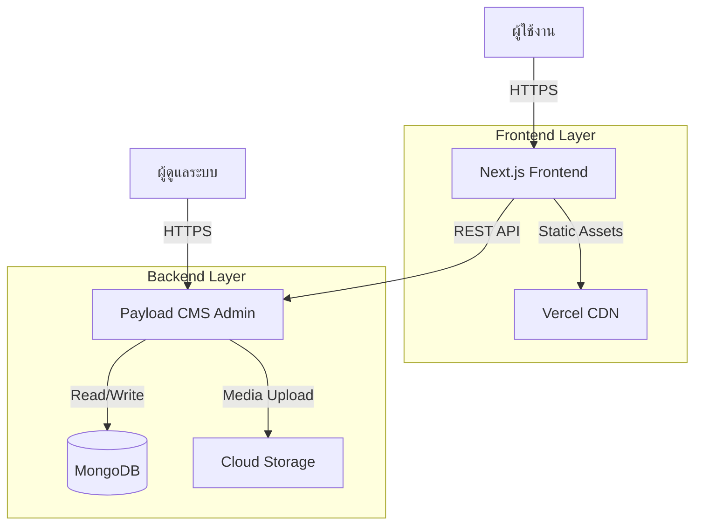
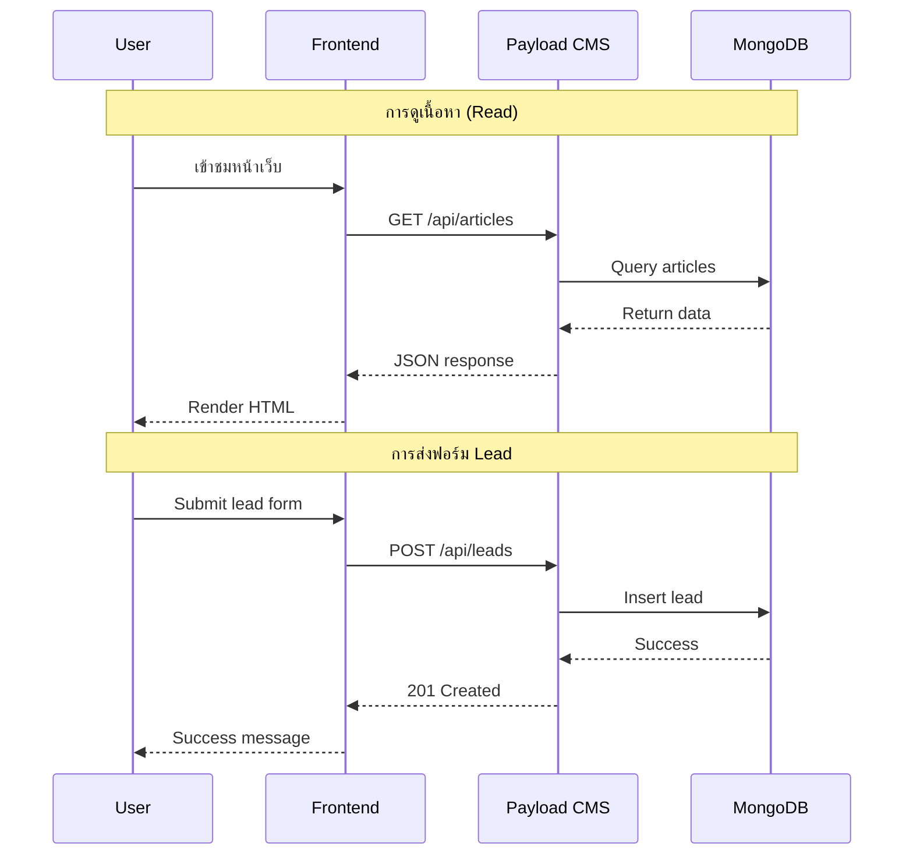
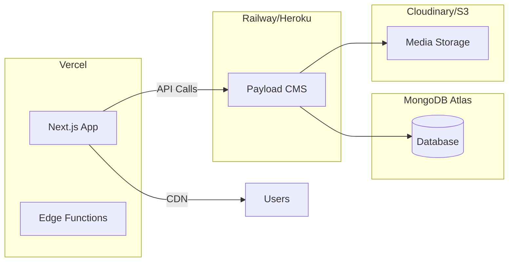
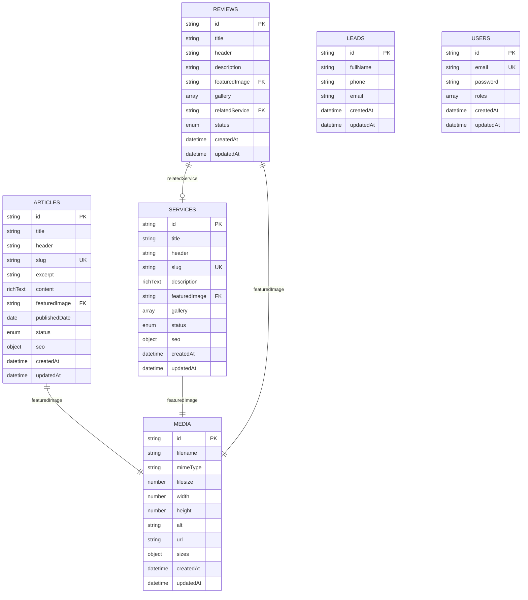

# เอกสารออกแบบระบบ (Design Document)

## ภาพรวม (Overview)

ระบบ CMS สำหรับธุรกิจโซล่าเซลล์เป็น Web Application แบบ Headless CMS Architecture ที่แยกส่วนหน้าบ้าน (Frontend) และส่วนหลังบ้าน (Backend) ออกจากกันอย่างชัดเจน

**เทคโนโลยีหลัก:**
- **Frontend**: Next.js 14+ (App Router) พร้อม Tailwind CSS สำหรับ styling
- **Backend/CMS**: Payload CMS 2.0+ (Headless CMS) ทำหน้าที่เป็น API และ Admin Panel
- **Database**: MongoDB (ใช้ร่วมกับ Payload CMS)
- **Deployment**: Vercel สำหรับ Frontend, Railway/Heroku สำหรับ Payload CMS

**จุดเด่นของสถาปัตยกรรม:**
1. **Headless Architecture**: Frontend และ Backend แยกกันสมบูรณ์ สื่อสารผ่าน REST API
2. **Static Generation**: ใช้ Next.js ISR (Incremental Static Regeneration) เพื่อ performance ที่ดี
3. **SEO Optimized**: Server-side rendering และ metadata management
4. **Responsive Design**: รองรับทุกขนาดหน้าจอด้วย Tailwind CSS
5. **Type Safety**: ใช้ TypeScript ทั้ง Frontend และ Backend

## สถาปัตยกรรม (Architecture)

### High-Level Architecture



### Data Flow



### Deployment Architecture



## คอมโพเนนต์และอินเทอร์เฟซ (Components and Interfaces)

### Frontend Components

#### 1. Page Components

**HeroSection Component**
```typescript
interface HeroSectionProps {
  header: string;
  title: string;
  media: {
    type: 'image' | 'video';
    url: string;
    alt?: string;
  };
}
```

**SolarCalculator Component**
```typescript
interface SolarCalculatorProps {
  // Static component - no props from CMS
}

interface CalculatorFormData {
  locationType: 'residential' | 'commercial' | 'industrial';
  monthlyBill: number;
  electricSystem: 'single-phase' | 'three-phase';
  dayNightRatio: number; // 0-100 (percentage of day usage)
}

interface CalculatorResult {
  recommendedCapacity: number; // kW
  estimatedCost: number; // THB
  paybackPeriod: number; // years
  monthlySavings: number; // THB
}
```

**ServiceCard Component**
```typescript
interface ServiceCardProps {
  id: string;
  image: string;
  header: string;
  title: string;
  slug: string;
}
```

**ReviewCard Component**
```typescript
interface ReviewCardProps {
  id: string;
  image: string;
  header: string;
  title: string;
  relatedService?: {
    id: string;
    title: string;
    slug: string;
  };
}
```

**ArticleCard Component**
```typescript
interface ArticleCardProps {
  id: string;
  image: string;
  header: string;
  title: string;
  excerpt: string;
  slug: string;
  publishedDate: string;
}
```

**LeadForm Component**
```typescript
interface LeadFormData {
  fullName: string;
  phone: string;
  email: string;
}

interface LeadFormValidation {
  fullName: { required: true; minLength: 2 };
  phone: { required: true; pattern: /^[0-9]{9,10}$/ };
  email: { required: true; pattern: /^[^\s@]+@[^\s@]+\.[^\s@]+$/ };
}
```

#### 2. Layout Components

**Header Component**
```typescript
interface HeaderProps {
  navigation: NavigationItem[];
}

interface NavigationItem {
  label: string;
  href: string;
}
```

**Footer Component**
```typescript
interface FooterProps {
  contactInfo: {
    phone: string;
    email: string;
    address: string;
  };
  socialLinks: SocialLink[];
}

interface SocialLink {
  platform: 'facebook' | 'line' | 'instagram';
  url: string;
}
```

### Backend (Payload CMS) Collections

#### 1. Articles Collection

```typescript
const Articles: CollectionConfig = {
  slug: 'articles',
  admin: {
    useAsTitle: 'title',
    defaultColumns: ['title', 'publishedDate', 'status'],
  },
  access: {
    read: () => true, // Public
    create: isAdmin,
    update: isAdmin,
    delete: isAdmin,
  },
  fields: [
    {
      name: 'title',
      type: 'text',
      required: true,
    },
    {
      name: 'header',
      type: 'text',
      required: true,
    },
    {
      name: 'slug',
      type: 'text',
      required: true,
      unique: true,
      admin: {
        description: 'URL-friendly version of title',
      },
    },
    {
      name: 'excerpt',
      type: 'textarea',
      required: true,
      maxLength: 200,
    },
    {
      name: 'content',
      type: 'richText',
      required: true,
    },
    {
      name: 'featuredImage',
      type: 'upload',
      relationTo: 'media',
      required: true,
    },
    {
      name: 'publishedDate',
      type: 'date',
      required: true,
      defaultValue: () => new Date(),
    },
    {
      name: 'status',
      type: 'select',
      options: ['draft', 'published'],
      defaultValue: 'draft',
      required: true,
    },
    {
      name: 'seo',
      type: 'group',
      fields: [
        {
          name: 'metaTitle',
          type: 'text',
          maxLength: 60,
        },
        {
          name: 'metaDescription',
          type: 'textarea',
          maxLength: 160,
        },
        {
          name: 'keywords',
          type: 'text',
        },
      ],
    },
  ],
};
```

#### 2. Services Collection

```typescript
const Services: CollectionConfig = {
  slug: 'services',
  admin: {
    useAsTitle: 'title',
    defaultColumns: ['title', 'status'],
  },
  access: {
    read: () => true,
    create: isAdmin,
    update: isAdmin,
    delete: isAdmin,
  },
  fields: [
    {
      name: 'title',
      type: 'text',
      required: true,
    },
    {
      name: 'header',
      type: 'text',
      required: true,
    },
    {
      name: 'slug',
      type: 'text',
      required: true,
      unique: true,
    },
    {
      name: 'description',
      type: 'richText',
      required: true,
    },
    {
      name: 'featuredImage',
      type: 'upload',
      relationTo: 'media',
      required: true,
    },
    {
      name: 'gallery',
      type: 'array',
      fields: [
        {
          name: 'image',
          type: 'upload',
          relationTo: 'media',
        },
      ],
    },
    {
      name: 'status',
      type: 'select',
      options: ['draft', 'published'],
      defaultValue: 'draft',
      required: true,
    },
    {
      name: 'seo',
      type: 'group',
      fields: [
        {
          name: 'metaTitle',
          type: 'text',
          maxLength: 60,
        },
        {
          name: 'metaDescription',
          type: 'textarea',
          maxLength: 160,
        },
        {
          name: 'keywords',
          type: 'text',
        },
      ],
    },
  ],
};
```

#### 3. Reviews Collection

```typescript
const Reviews: CollectionConfig = {
  slug: 'reviews',
  admin: {
    useAsTitle: 'title',
    defaultColumns: ['title', 'relatedService', 'status'],
  },
  access: {
    read: () => true,
    create: isAdmin,
    update: isAdmin,
    delete: isAdmin,
  },
  fields: [
    {
      name: 'title',
      type: 'text',
      required: true,
    },
    {
      name: 'header',
      type: 'text',
      required: true,
    },
    {
      name: 'description',
      type: 'textarea',
      required: true,
    },
    {
      name: 'featuredImage',
      type: 'upload',
      relationTo: 'media',
      required: true,
    },
    {
      name: 'gallery',
      type: 'array',
      fields: [
        {
          name: 'image',
          type: 'upload',
          relationTo: 'media',
        },
      ],
    },
    {
      name: 'relatedService',
      type: 'relationship',
      relationTo: 'services',
      required: false,
    },
    {
      name: 'status',
      type: 'select',
      options: ['draft', 'published'],
      defaultValue: 'draft',
      required: true,
    },
  ],
};
```

#### 4. Leads Collection

```typescript
const Leads: CollectionConfig = {
  slug: 'leads',
  admin: {
    useAsTitle: 'fullName',
    defaultColumns: ['fullName', 'phone', 'email', 'createdAt'],
  },
  access: {
    read: isAdmin,
    create: () => true, // Allow public creation via API
    update: () => false, // No updates allowed
    delete: () => false, // No deletion allowed
  },
  fields: [
    {
      name: 'fullName',
      type: 'text',
      required: true,
    },
    {
      name: 'phone',
      type: 'text',
      required: true,
      validate: (val) => {
        if (!/^[0-9]{9,10}$/.test(val)) {
          return 'เบอร์โทรศัพท์ไม่ถูกต้อง';
        }
        return true;
      },
    },
    {
      name: 'email',
      type: 'email',
      required: true,
    },
  ],
  timestamps: true, // Auto-add createdAt and updatedAt
};
```

#### 5. Media Collection

```typescript
const Media: CollectionConfig = {
  slug: 'media',
  upload: {
    staticURL: '/media',
    staticDir: 'media',
    imageSizes: [
      {
        name: 'thumbnail',
        width: 400,
        height: 300,
        position: 'centre',
      },
      {
        name: 'card',
        width: 768,
        height: 576,
        position: 'centre',
      },
      {
        name: 'hero',
        width: 1920,
        height: 1080,
        position: 'centre',
      },
    ],
    adminThumbnail: 'thumbnail',
    mimeTypes: ['image/*', 'video/*'],
  },
  access: {
    read: () => true,
    create: isAdmin,
    update: isAdmin,
    delete: isAdmin,
  },
  fields: [
    {
      name: 'alt',
      type: 'text',
    },
  ],
};
```

### API Endpoints

#### Frontend API Routes (Next.js)

```typescript
// /api/calculator/route.ts
interface CalculateRequest {
  locationType: string;
  monthlyBill: number;
  electricSystem: string;
  dayNightRatio: number;
}

interface CalculateResponse {
  recommendedCapacity: number;
  estimatedCost: number;
  paybackPeriod: number;
  monthlySavings: number;
}

// POST /api/calculator
export async function POST(request: Request): Promise<Response>
```

#### Payload CMS API Endpoints

```
GET    /api/articles              - รายการบทความทั้งหมด
GET    /api/articles/:id          - บทความเดี่ยว
GET    /api/articles/slug/:slug   - บทความตาม slug
POST   /api/articles              - สร้างบทความใหม่ (Admin only)
PATCH  /api/articles/:id          - แก้ไขบทความ (Admin only)
DELETE /api/articles/:id          - ลบบทความ (Admin only)

GET    /api/services              - รายการบริการทั้งหมด
GET    /api/services/:id          - บริการเดี่ยว
GET    /api/services/slug/:slug   - บริการตาม slug
POST   /api/services              - สร้างบริการใหม่ (Admin only)
PATCH  /api/services/:id          - แก้ไขบริการ (Admin only)
DELETE /api/services/:id          - ลบบริการ (Admin only)

GET    /api/reviews               - รายการรีวิวทั้งหมด
GET    /api/reviews/:id           - รีวิวเดี่ยว
POST   /api/reviews               - สร้างรีวิวใหม่ (Admin only)
PATCH  /api/reviews/:id           - แก้ไขรีวิว (Admin only)
DELETE /api/reviews/:id           - ลบรีวิว (Admin only)

GET    /api/leads                 - รายการ leads ทั้งหมด (Admin only)
GET    /api/leads/:id             - Lead เดี่ยว (Admin only)
POST   /api/leads                 - สร้าง lead ใหม่ (Public)

POST   /api/users/login           - Login
POST   /api/users/logout          - Logout
GET    /api/users/me              - ข้อมูล user ปัจจุบัน
```

## โมเดลข้อมูล (Data Models)

### Entity Relationship Diagram



### Data Validation Rules

**Articles:**
- title: required, max 200 characters
- slug: required, unique, URL-safe format
- excerpt: required, max 200 characters
- content: required, rich text format
- publishedDate: required, valid date
- status: required, enum ['draft', 'published']
- seo.metaTitle: optional, max 60 characters
- seo.metaDescription: optional, max 160 characters

**Services:**
- title: required, max 200 characters
- slug: required, unique, URL-safe format
- description: required, rich text format
- status: required, enum ['draft', 'published']
- seo.metaTitle: optional, max 60 characters
- seo.metaDescription: optional, max 160 characters

**Reviews:**
- title: required, max 200 characters
- description: required, max 500 characters
- relatedService: optional, valid service ID
- status: required, enum ['draft', 'published']

**Leads:**
- fullName: required, min 2 characters, max 100 characters
- phone: required, pattern /^[0-9]{9,10}$/
- email: required, valid email format
- Cannot be updated or deleted after creation

### Solar Calculator Logic

**สูตรคำนวณ:**

```typescript
function calculateSolarSystem(input: CalculatorFormData): CalculatorResult {
  // Constants
  const ELECTRICITY_RATE = 4.5; // THB per kWh (average)
  const SOLAR_COST_PER_KW = 45000; // THB per kW installed
  const PEAK_SUN_HOURS = 4.5; // hours per day (Thailand average)
  const SYSTEM_EFFICIENCY = 0.85; // 85% efficiency
  
  // Location multipliers
  const locationMultipliers = {
    residential: 1.0,
    commercial: 1.2,
    industrial: 1.5,
  };
  
  // Calculate daily consumption
  const monthlyConsumption = input.monthlyBill / ELECTRICITY_RATE; // kWh
  const dailyConsumption = monthlyConsumption / 30; // kWh per day
  
  // Adjust for day/night ratio
  const dayUsageRatio = input.dayNightRatio / 100;
  const effectiveDailyConsumption = dailyConsumption * dayUsageRatio;
  
  // Calculate required capacity
  const requiredCapacity = 
    effectiveDailyConsumption / 
    (PEAK_SUN_HOURS * SYSTEM_EFFICIENCY);
  
  // Apply location multiplier
  const locationMultiplier = locationMultipliers[input.locationType];
  const recommendedCapacity = 
    Math.ceil(requiredCapacity * locationMultiplier * 10) / 10; // Round to 0.1 kW
  
  // Calculate costs
  const estimatedCost = recommendedCapacity * SOLAR_COST_PER_KW;
  
  // Calculate savings
  const dailyGeneration = 
    recommendedCapacity * PEAK_SUN_HOURS * SYSTEM_EFFICIENCY;
  const monthlySavings = dailyGeneration * 30 * ELECTRICITY_RATE;
  
  // Calculate payback period
  const paybackPeriod = estimatedCost / (monthlySavings * 12);
  
  return {
    recommendedCapacity: Math.round(recommendedCapacity * 10) / 10,
    estimatedCost: Math.round(estimatedCost),
    paybackPeriod: Math.round(paybackPeriod * 10) / 10,
    monthlySavings: Math.round(monthlySavings),
  };
}
```

**หมายเหตุ:** สูตรนี้เป็น Static และไม่สามารถแก้ไขผ่าน CMS ได้ ค่าคงที่ต่างๆ จะถูก hardcode ในโค้ด


## คุณสมบัติความถูกต้อง (Correctness Properties)

Property คือลักษณะหรือพฤติกรรมที่ควรเป็นจริงในทุกการทำงานที่ถูกต้องของระบบ เป็นการระบุอย่างเป็นทางการเกี่ยวกับสิ่งที่ระบบควรทำ Properties ทำหน้าที่เป็นสะพานเชื่อมระหว่างข้อกำหนดที่มนุษย์อ่านได้กับการรับประกันความถูกต้องที่เครื่องจักรสามารถตรวจสอบได้

### Property 1: Solar Calculator Calculation Accuracy

*สำหรับ* input ใดๆ ที่ valid (locationType, monthlyBill > 0, electricSystem, dayNightRatio 0-100) เมื่อคำนวณด้วย Solar Calculator ผลลัพธ์ที่ได้ (recommendedCapacity, estimatedCost, paybackPeriod, monthlySavings) ต้องมีค่าเป็นบวกและสมเหตุสมผล (capacity > 0, cost > 0, payback > 0, savings > 0)

**Validates: Requirements 2.5**

### Property 2: Service Card Content Completeness

*สำหรับ* Service ใดๆ ที่มีสถานะ published เมื่อแสดงเป็น Service Card ต้องมีองค์ประกอบครบถ้วน (image, header, title) และสามารถคลิกเพื่อไปยังหน้ารายละเอียดได้

**Validates: Requirements 3.2, 3.3**

### Property 3: Review Card Content and Relationship

*สำหรับ* Review ใดๆ ที่มีสถานะ published เมื่อแสดงเป็น Review Card ต้องมีองค์ประกอบครบถ้วน (image, header, title) และถ้ามี relatedService ต้องมี link ไปยัง Service นั้นที่ถูกต้อง

**Validates: Requirements 4.2, 4.3**

### Property 4: Article Content Completeness

*สำหรับ* Article ใดๆ ที่มีสถานะ published เมื่อแสดงหน้ารายละเอียด ต้องมีองค์ประกอบครบถ้วน (header, title, rich text content, featured image/video)

**Validates: Requirements 5.2**

### Property 5: Lead Form Validation - Valid Data

*สำหรับ* lead data ใดๆ ที่ valid (fullName มีความยาว >= 2, phone ตรงกับ pattern /^[0-9]{9,10}$/, email เป็น format ที่ถูกต้อง) เมื่อส่งฟอร์ม ระบบต้องบันทึกข้อมูลลง Payload CMS สำเร็จและ return success response

**Validates: Requirements 6.2**

### Property 6: Lead Form Validation - Invalid Data

*สำหรับ* lead data ใดๆ ที่ invalid (fullName สั้นเกินไป, phone ไม่ตรง pattern, email format ผิด, หรือฟิลด์ว่าง) เมื่อพยายามส่งฟอร์ม ระบบต้องแสดงข้อความแจ้งเตือนและป้องกันการ submit

**Validates: Requirements 6.3**

### Property 7: API Integration - Content Retrieval

*สำหรับ* content type ใดๆ (articles, services, reviews) เมื่อ Frontend เรียก Payload CMS API ต้องได้รับข้อมูลที่ถูกต้องและครบถ้วนตาม schema ที่กำหนด

**Validates: Requirements 7.6, 8.6, 9.6**

### Property 8: SEO Metadata Rendering

*สำหรับ* content ใดๆ (article, service) ที่มี SEO metadata (metaTitle, metaDescription, keywords) เมื่อ render หน้าเว็บ ต้องมี meta tags ที่ถูกต้องใน HTML head และมี Open Graph tags สำหรับ social sharing

**Validates: Requirements 3.5, 5.4, 15.2, 15.4**

### Property 9: Semantic HTML Structure

*สำหรับ* หน้าเว็บใดๆ ที่แสดง content (article, service, review) ต้องใช้ semantic HTML tags ที่เหมาะสม (article, section, header, main, footer, nav, h1-h6) ตามโครงสร้างเนื้อหา

**Validates: Requirements 5.5, 15.1**

### Property 10: Image Optimization and Lazy Loading

*สำหรับ* รูปภาพใดๆ ที่แสดงในเว็บไซต์ ต้องถูก optimize (มีหลายขนาดตาม responsive breakpoints) และรูปภาพที่อยู่นอกหน้าจอต้องมี lazy loading attribute

**Validates: Requirements 13.2, 13.4**

## การจัดการข้อผิดพลาด (Error Handling)

### Frontend Error Handling

**API Call Failures:**
```typescript
try {
  const response = await fetch(`${PAYLOAD_API_URL}/api/articles`);
  if (!response.ok) {
    throw new Error(`API Error: ${response.status}`);
  }
  const data = await response.json();
  return data;
} catch (error) {
  console.error('Failed to fetch articles:', error);
  // Show user-friendly error message
  return { error: 'ไม่สามารถโหลดข้อมูลได้ กรุณาลองใหม่อีกครั้ง' };
}
```

**Form Validation Errors:**
```typescript
interface ValidationError {
  field: string;
  message: string;
}

function validateLeadForm(data: LeadFormData): ValidationError[] {
  const errors: ValidationError[] = [];
  
  if (!data.fullName || data.fullName.length < 2) {
    errors.push({
      field: 'fullName',
      message: 'กรุณากรอกชื่อ-นามสกุล (อย่างน้อย 2 ตัวอักษร)',
    });
  }
  
  if (!data.phone || !/^[0-9]{9,10}$/.test(data.phone)) {
    errors.push({
      field: 'phone',
      message: 'กรุณากรอกเบอร์โทรศัพท์ที่ถูกต้อง (9-10 หลัก)',
    });
  }
  
  if (!data.email || !/^[^\s@]+@[^\s@]+\.[^\s@]+$/.test(data.email)) {
    errors.push({
      field: 'email',
      message: 'กรุณากรอกอีเมลที่ถูกต้อง',
    });
  }
  
  return errors;
}
```

**Solar Calculator Input Validation:**
```typescript
function validateCalculatorInput(input: CalculatorFormData): string | null {
  if (input.monthlyBill <= 0) {
    return 'กรุณากรอกค่าไฟฟ้าที่มากกว่า 0';
  }
  
  if (input.dayNightRatio < 0 || input.dayNightRatio > 100) {
    return 'สัดส่วนการใช้ไฟต้องอยู่ระหว่าง 0-100%';
  }
  
  if (!['residential', 'commercial', 'industrial'].includes(input.locationType)) {
    return 'กรุณาเลือกประเภทสถานที่ติดตั้ง';
  }
  
  if (!['single-phase', 'three-phase'].includes(input.electricSystem)) {
    return 'กรุณาเลือกระบบไฟฟ้า';
  }
  
  return null; // No errors
}
```

### Backend Error Handling (Payload CMS)

**API Error Responses:**
```typescript
// Payload CMS จัดการ error responses โดยอัตโนมัติ:
// - 400 Bad Request: Invalid input data
// - 401 Unauthorized: Not authenticated
// - 403 Forbidden: Not authorized
// - 404 Not Found: Resource not found
// - 500 Internal Server Error: Server error
```

**Custom Validation Hooks:**
```typescript
const Leads: CollectionConfig = {
  slug: 'leads',
  hooks: {
    beforeValidate: [
      ({ data }) => {
        // Sanitize phone number (remove spaces, dashes)
        if (data.phone) {
          data.phone = data.phone.replace(/[\s-]/g, '');
        }
        return data;
      },
    ],
    afterChange: [
      async ({ doc, operation }) => {
        if (operation === 'create') {
          // Log new lead for monitoring
          console.log('New lead received:', {
            id: doc.id,
            fullName: doc.fullName,
            createdAt: doc.createdAt,
          });
        }
      },
    ],
  ],
};
```

### Error Logging and Monitoring

**Frontend Error Logging:**
```typescript
// Use error boundary for React components
class ErrorBoundary extends React.Component {
  componentDidCatch(error: Error, errorInfo: React.ErrorInfo) {
    // Log to monitoring service (e.g., Sentry)
    console.error('Component error:', error, errorInfo);
  }
  
  render() {
    if (this.state.hasError) {
      return <ErrorFallback />;
    }
    return this.props.children;
  }
}
```

**Backend Error Logging:**
```typescript
// Payload CMS has built-in error logging
// Additional custom logging can be added via hooks
```

## กลยุทธ์การทดสอบ (Testing Strategy)

### Dual Testing Approach

ระบบนี้ใช้การทดสอบแบบ 2 รูปแบบที่เสริมกัน:

1. **Unit Tests**: ทดสอบตัวอย่างเฉพาะ, edge cases, และเงื่อนไขข้อผิดพลาด
2. **Property-Based Tests**: ทดสอบ properties สากลที่ครอบคลุม input ทั้งหมด

ทั้งสองแบบจำเป็นสำหรับการทดสอบที่ครอบคลุม โดย unit tests จับ bugs เฉพาะเจาะจง ส่วน property tests ตรวจสอบความถูกต้องโดยรวม

### Unit Testing

**เครื่องมือ:**
- **Frontend**: Jest + React Testing Library
- **Backend**: Jest + Supertest (สำหรับ API testing)

**ขอบเขตการทดสอบ:**

1. **Component Tests**:
   - ทดสอบว่า components render ถูกต้อง
   - ทดสอบ user interactions (clicks, form submissions)
   - ทดสอบ conditional rendering

2. **API Integration Tests**:
   - ทดสอบการเรียก Payload CMS API
   - ทดสอบ error handling เมื่อ API fail
   - ทดสอบ data transformation

3. **Validation Tests**:
   - ทดสอบ form validation logic
   - ทดสอบ calculator input validation
   - ทดสอบ edge cases (empty strings, special characters)

**ตัวอย่าง Unit Tests:**

```typescript
// Solar Calculator validation test
describe('validateCalculatorInput', () => {
  it('should reject negative monthly bill', () => {
    const input = {
      locationType: 'residential',
      monthlyBill: -100,
      electricSystem: 'single-phase',
      dayNightRatio: 50,
    };
    expect(validateCalculatorInput(input)).toBe('กรุณากรอกค่าไฟฟ้าที่มากกว่า 0');
  });
  
  it('should reject day/night ratio > 100', () => {
    const input = {
      locationType: 'residential',
      monthlyBill: 3000,
      electricSystem: 'single-phase',
      dayNightRatio: 150,
    };
    expect(validateCalculatorInput(input)).toBe('สัดส่วนการใช้ไฟต้องอยู่ระหว่าง 0-100%');
  });
  
  it('should accept valid input', () => {
    const input = {
      locationType: 'residential',
      monthlyBill: 3000,
      electricSystem: 'single-phase',
      dayNightRatio: 60,
    };
    expect(validateCalculatorInput(input)).toBeNull();
  });
});

// Lead form validation test
describe('validateLeadForm', () => {
  it('should reject short full name', () => {
    const data = { fullName: 'A', phone: '0812345678', email: 'test@example.com' };
    const errors = validateLeadForm(data);
    expect(errors).toContainEqual({
      field: 'fullName',
      message: expect.stringContaining('อย่างน้อย 2 ตัวอักษร'),
    });
  });
  
  it('should reject invalid phone format', () => {
    const data = { fullName: 'John Doe', phone: '123', email: 'test@example.com' };
    const errors = validateLeadForm(data);
    expect(errors).toContainEqual({
      field: 'phone',
      message: expect.stringContaining('เบอร์โทรศัพท์ที่ถูกต้อง'),
    });
  });
  
  it('should accept valid lead data', () => {
    const data = { fullName: 'John Doe', phone: '0812345678', email: 'test@example.com' };
    const errors = validateLeadForm(data);
    expect(errors).toHaveLength(0);
  });
});
```

### Property-Based Testing

**เครื่องมือ:**
- **fast-check** (JavaScript/TypeScript property-based testing library)

**การตั้งค่า:**
- แต่ละ property test ต้องรันอย่างน้อย **100 iterations**
- แต่ละ test ต้องมี comment อ้างอิง property จาก design document
- Tag format: **Feature: solar-cell-cms, Property {number}: {property_text}**

**ตัวอย่าง Property-Based Tests:**

```typescript
import fc from 'fast-check';

// Feature: solar-cell-cms, Property 1: Solar Calculator Calculation Accuracy
describe('Property 1: Solar Calculator Calculation Accuracy', () => {
  it('should produce positive results for all valid inputs', () => {
    fc.assert(
      fc.property(
        fc.constantFrom('residential', 'commercial', 'industrial'),
        fc.float({ min: 100, max: 50000 }), // monthlyBill
        fc.constantFrom('single-phase', 'three-phase'),
        fc.integer({ min: 0, max: 100 }), // dayNightRatio
        (locationType, monthlyBill, electricSystem, dayNightRatio) => {
          const input = { locationType, monthlyBill, electricSystem, dayNightRatio };
          const result = calculateSolarSystem(input);
          
          // All results must be positive
          expect(result.recommendedCapacity).toBeGreaterThan(0);
          expect(result.estimatedCost).toBeGreaterThan(0);
          expect(result.paybackPeriod).toBeGreaterThan(0);
          expect(result.monthlySavings).toBeGreaterThan(0);
        }
      ),
      { numRuns: 100 }
    );
  });
});

// Feature: solar-cell-cms, Property 5: Lead Form Validation - Valid Data
describe('Property 5: Lead Form Validation - Valid Data', () => {
  it('should successfully save all valid lead data', async () => {
    fc.assert(
      fc.asyncProperty(
        fc.string({ minLength: 2, maxLength: 100 }), // fullName
        fc.stringOf(fc.integer({ min: 0, max: 9 }).map(String), { minLength: 9, maxLength: 10 }), // phone
        fc.emailAddress(), // email
        async (fullName, phone, email) => {
          const leadData = { fullName, phone, email };
          const response = await submitLeadForm(leadData);
          
          expect(response.success).toBe(true);
          expect(response.data.id).toBeDefined();
        }
      ),
      { numRuns: 100 }
    );
  });
});

// Feature: solar-cell-cms, Property 6: Lead Form Validation - Invalid Data
describe('Property 6: Lead Form Validation - Invalid Data', () => {
  it('should reject lead data with invalid phone numbers', () => {
    fc.assert(
      fc.property(
        fc.string({ minLength: 2, maxLength: 100 }),
        fc.string().filter(s => !/^[0-9]{9,10}$/.test(s)), // invalid phone
        fc.emailAddress(),
        (fullName, phone, email) => {
          const leadData = { fullName, phone, email };
          const errors = validateLeadForm(leadData);
          
          expect(errors.some(e => e.field === 'phone')).toBe(true);
        }
      ),
      { numRuns: 100 }
    );
  });
  
  it('should reject lead data with invalid emails', () => {
    fc.assert(
      fc.property(
        fc.string({ minLength: 2, maxLength: 100 }),
        fc.stringOf(fc.integer({ min: 0, max: 9 }).map(String), { minLength: 9, maxLength: 10 }),
        fc.string().filter(s => !/^[^\s@]+@[^\s@]+\.[^\s@]+$/.test(s)), // invalid email
        (fullName, phone, email) => {
          const leadData = { fullName, phone, email };
          const errors = validateLeadForm(leadData);
          
          expect(errors.some(e => e.field === 'email')).toBe(true);
        }
      ),
      { numRuns: 100 }
    );
  });
});

// Feature: solar-cell-cms, Property 8: SEO Metadata Rendering
describe('Property 8: SEO Metadata Rendering', () => {
  it('should render meta tags for all content with SEO metadata', () => {
    fc.assert(
      fc.property(
        fc.record({
          title: fc.string({ minLength: 1, maxLength: 200 }),
          slug: fc.string({ minLength: 1, maxLength: 100 }),
          seo: fc.record({
            metaTitle: fc.string({ minLength: 1, maxLength: 60 }),
            metaDescription: fc.string({ minLength: 1, maxLength: 160 }),
            keywords: fc.string({ minLength: 1, maxLength: 200 }),
          }),
        }),
        (content) => {
          const html = renderContentPage(content);
          
          // Check meta tags exist
          expect(html).toContain(`<title>${content.seo.metaTitle}</title>`);
          expect(html).toContain(`<meta name="description" content="${content.seo.metaDescription}">`);
          expect(html).toContain(`<meta name="keywords" content="${content.seo.keywords}">`);
          
          // Check Open Graph tags
          expect(html).toContain(`<meta property="og:title" content="${content.seo.metaTitle}">`);
          expect(html).toContain(`<meta property="og:description" content="${content.seo.metaDescription}">`);
        }
      ),
      { numRuns: 100 }
    );
  });
});

// Feature: solar-cell-cms, Property 10: Image Optimization and Lazy Loading
describe('Property 10: Image Optimization and Lazy Loading', () => {
  it('should apply lazy loading to all images', () => {
    fc.assert(
      fc.property(
        fc.array(
          fc.record({
            url: fc.webUrl(),
            alt: fc.string(),
          }),
          { minLength: 1, maxLength: 20 }
        ),
        (images) => {
          const html = renderImageGallery(images);
          
          // All images should have loading="lazy"
          const imgTags = html.match(/]*>/g) || [];
          imgTags.forEach(tag => {
            expect(tag).toContain('loading="lazy"');
          });
        }
      ),
      { numRuns: 100 }
    );
  });
});
```

### Integration Testing

**ขอบเขต:**
- ทดสอบการเชื่อมต่อระหว่าง Frontend และ Payload CMS
- ทดสอบ end-to-end flows (เช่น การส่งฟอร์ม lead)
- ทดสอบ authentication และ authorization

**เครื่องมือ:**
- Playwright หรือ Cypress สำหรับ E2E testing

### Performance Testing

**เครื่องมือ:**
- Lighthouse CI สำหรับ performance metrics
- WebPageTest สำหรับ detailed analysis

**เป้าหมาย:**
- First Contentful Paint (FCP) < 1.5s
- Largest Contentful Paint (LCP) < 2.5s
- Time to Interactive (TTI) < 3.0s
- Cumulative Layout Shift (CLS) < 0.1

### Testing Coverage Goals

- **Unit Tests**: 80%+ code coverage
- **Property Tests**: ครอบคลุม properties ทั้ง 10 ข้อ
- **Integration Tests**: ครอบคลุม critical user flows
- **E2E Tests**: ครอบคลุม main user journeys

### Continuous Integration

**CI Pipeline:**
1. Run linting (ESLint, Prettier)
2. Run type checking (TypeScript)
3. Run unit tests
4. Run property-based tests
5. Run integration tests
6. Build application
7. Run Lighthouse CI
8. Deploy to staging (if all tests pass)

**Test Execution Order:**
1. Fast tests first (unit tests, property tests)
2. Slower tests later (integration tests, E2E tests)
3. Performance tests on staging environment
